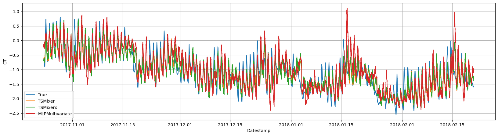
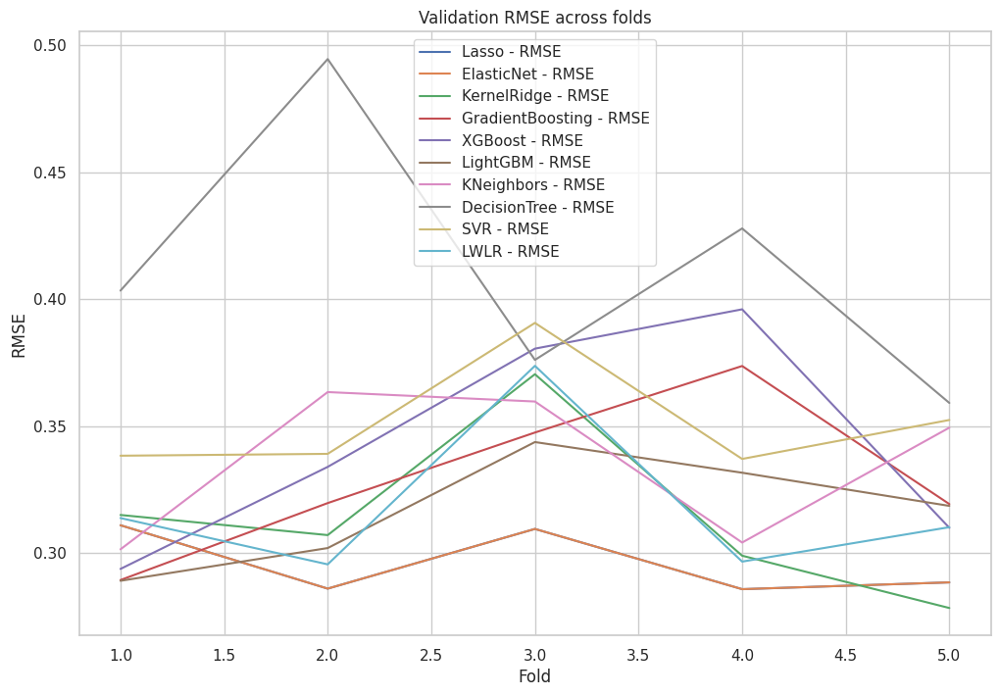
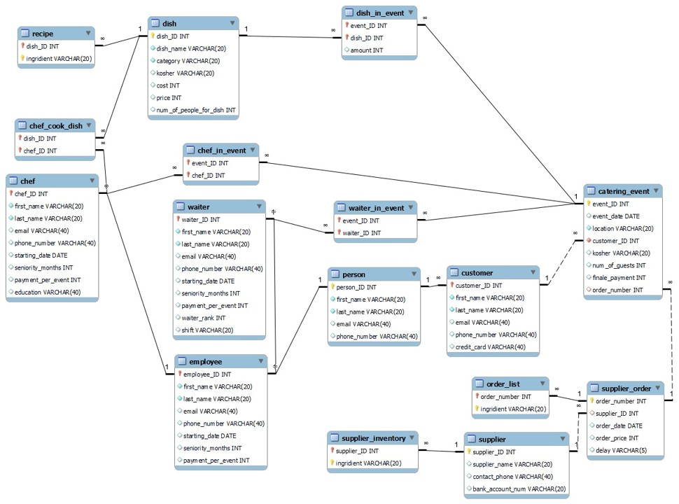
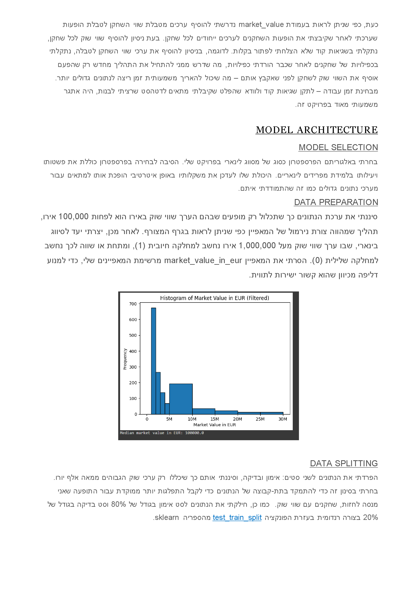
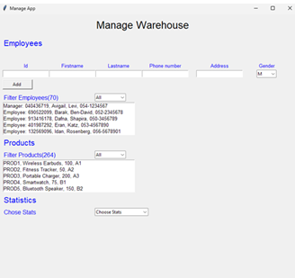
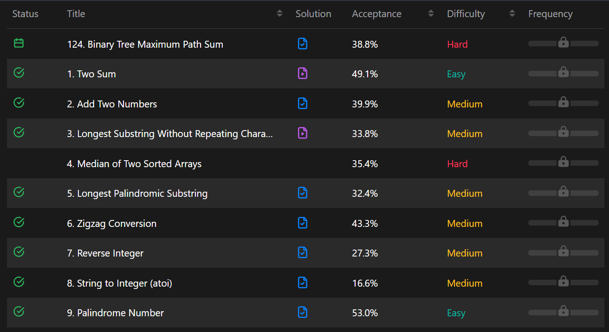

[.%3B+AdamW+as+Natural+Gradient+Descent.;Building+decisive,+actionable+AI+from+noise.)](https://git.io/typing-svg)

 
  

 

 
  
  
  

<h2 align="center"> Commit Statistics</h2>

  <!-- First Card -->
  

  <!-- Second Card -->
  

<h2 align="center"> Past Work </h2>
 

  <table>
    <tr>
      <!-- Time Twist Visualizer (NEW) -->
      <td align="center">
        
         
        <a href="https://github.com/ShovalBenjer/time-twist-visualizer"><b>Time Twist Visualizer</b></a>
        
A Rust-based TUI for visualizing Git commit history as an interactive graph.

        <!-- Repo Card for Time Twist Visualizer -->
        
      </td>
      <!-- PhantomReach -->
      <td align="center">
        
         
        <a href="https://github.com/phantomreach/phantom-reach-poc"><b>PhantomReach</b></a>
        

          AR-based model with pose detection, achieving 95% accuracy and under 100ms latency.
           
          
        

        <!-- Repo Card for PhantomReach -->
        
      </td>
      <!-- SoloSolve AI -->
      <td align="center">
        
         
        <a href="https://github.com/solosolve-ai/solosolve-ai-demo"><b>SoloSolve AI</b></a>
        

          AI-driven system achieving faster resolutions with NLP and clustering tools.
           
          
        

        <!-- Repo Card for SoloSolve AI -->
        
      </td>
    </tr>
    <tr>
      <!-- Bank Product Changes -->
      <td align="center">
        
         
        <a href="https://github.com/ShovalBenjer/Bank-Change-Prediction"><b>Bank Product Multivariate Classification for Insait.io</b></a>
        
Built time-series models for accurate bank product predictions.

        <!-- Repo Card for Bank Product Changes -->
        
      </td>
      <!-- Big Data Stack with PySpark -->
      <td align="center">
        
         
        <a href="https://github.com/ShovalBenjer/Bigdata_Pyspark_Spark_Hadoop_Apache"><b>Big Data Stack (Kafka & Spark)</b></a>
        

          End-to-end big data processing with Spark, Hadoop, and Apache stack on local and cloud clusters.
        

        
      </td>      
      <!-- Housing Price Prediction -->
      <td align="center">
        
         
        <a href="https://github.com/ShovalBenjer/Housing_Price_Prediction_Advanced_Regresson_Kaggle"><b>Housing Price Prediction</b></a>
        
Top 6% Kaggle project with advanced regression techniques.

        <!-- Repo Card for Housing Price Prediction -->
        
      </td>
    </tr>
    <tr>
      <!-- Catering Management -->
      <td align="center">
        
         
        <a href="https://github.com/ShovalBenjer/Catering_Company_Management_System"><b>Catering Management</b></a>
        
Optimized SQL scripts for HR and inventory modules.

        <!-- Repo Card for Catering Management -->
        
      </td>
      <!-- Soccer Market Prediction -->
      <td align="center">
        
         
        <a href="https://github.com/ShovalBenjer/CS_188-Introduction-to-Artificial-Intelligence-Final_Project"><b>Soccer Market Prediction</b></a>
        
ML model for soccer player market analysis.

        <!-- Repo Card for Soccer Market Prediction -->
        
      </td>
      <!-- Warehouse Management -->
      <td align="center">
        
         
        <a href="https://github.com/ShovalBenjer/Manage-Warehouse-OOP-Python"><b>Warehouse Management</b></a>
        
OOP-based inventory and order system in Python.

        <!-- Repo Card for Warehouse Management -->
        
      </td>
    </tr>
    <tr>
      <!-- Algorithms / Dynamic Programming -->
      <td align="center">
        
         
        <a href="https://github.com/ShovalBenjer/Algorithms_DynamicProgramming_Codechef_Competition_Submissions"><b>Algorithms DP Submissions</b></a>
        
Codechef competition submissions with dynamic programming algorithms.

        <!-- Repo Card for Algorithms DP -->
        
      </td>
      <!-- Empty placeholders to keep alignment -->
      <td></td>
      <td></td>
    </tr>
  </table>

